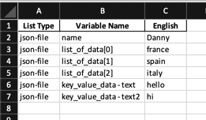

# json-dir-to-excel 
Neat wee recursive script which parses a directory of JSON files into a three column xlsx file (filename, key and value).

Feel free to use as you wish. It was initially used to get a list of locale-specific translations, but is probably generally pretty useful in a lot of situations.

e.g. an input of the following, in a file called **json-file.json**:

```json
{
  "name": "Danny",
  "list_of_data": [
    "france",
    "spain",
    "italy"
  ],
  "key_value_data": {
    "text": "hello",
    "text2": "hi"
  }
}

```

The above file will produce the following excel sheet:
